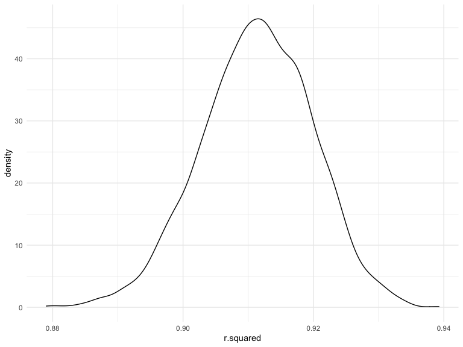

HW6
================

# Problem 1

## Load dataset

``` r
birthweight = read_csv("data/birthweight.csv") %>% 
  mutate(
    babysex = factor(babysex),
    frace = factor(frace),
    malform = factor(malform),
    mrace = factor(mrace)
  ) %>% 
  select(-pnumlbw, -pnumsga)
```

    ## Rows: 4342 Columns: 20

    ## ── Column specification ────────────────────────────────────────────────────────
    ## Delimiter: ","
    ## dbl (20): babysex, bhead, blength, bwt, delwt, fincome, frace, gaweeks, malf...

    ## 
    ## ℹ Use `spec()` to retrieve the full column specification for this data.
    ## ℹ Specify the column types or set `show_col_types = FALSE` to quiet this message.

We drop “pnumlbw” and “pnumsage” column because they only have “0”
values and give no information to differentiate the children.

## Regression Model

``` r
fit = lm(bwt ~ delwt + menarche + mheight + momage + mrace + smoken + wtgain, data = birthweight)
```

``` r
birthweight_fit = modelr::add_residuals(birthweight, fit)
modelr::add_predictions(birthweight_fit, fit) %>% 
  ggplot(aes(x = pred, y = resid)) + 
  geom_point() + 
  geom_smooth()
```

    ## `geom_smooth()` using method = 'gam' and formula 'y ~ s(x, bs = "cs")'


## Cross validation comparion with two other models

``` r
cv_df = crossv_mc(birthweight, 100) %>% 
  mutate(train = map(train, as_tibble),
         test = map(test, as_tibble)) %>% 
  mutate(
    mother_mod = map(train, ~lm(bwt ~ delwt + menarche + mheight + momage + mrace + parity + ppbmi + ppwt + smoken + wtgain, data = .x)),
    main_mod = map(train,~lm(bwt ~ blength + gaweeks,data = .x)),
    three_mod = map(train,~lm(bwt ~ bhead + blength + babysex 
                              + bhead*blength + bhead*babysex + blength*babysex 
                              + bhead*blength*babysex, data = .x))
  ) %>% 
  mutate(
    rmse_mother = map2_dbl(mother_mod, test ,~rmse(model = .x,data = .y)),
    rmse_main = map2_dbl(main_mod, test ,~rmse(model = .x,data = .y)),
    rmse_three = map2_dbl(three_mod, test ,~rmse(model = .x,data = .y))
  )
```

``` r
cv_df %>% 
  select(starts_with("rmse")) %>% 
  pivot_longer(
    everything(),
    names_to = "model", 
    values_to = "rmse",
    names_prefix = "rmse_") %>% 
  mutate(model = fct_inorder(model)) %>% 
  ggplot(aes(x = model, y = rmse)) + geom_violin()
```


# Problem 2

``` r
weather_df = 
  rnoaa::meteo_pull_monitors(
    c("USW00094728"),
    var = c("PRCP", "TMIN", "TMAX"), 
    date_min = "2017-01-01",
    date_max = "2017-12-31") %>%
  mutate(
    name = recode(id, USW00094728 = "CentralPark_NY"),
    tmin = tmin / 10,
    tmax = tmax / 10) %>%
  select(name, id, everything())
```

    ## Registered S3 method overwritten by 'hoardr':
    ##   method           from
    ##   print.cache_info httr

    ## using cached file: ~/Library/Caches/R/noaa_ghcnd/USW00094728.dly

    ## date created (size, mb): 2021-12-03 22:22:58 (7.616)

    ## file min/max dates: 1869-01-01 / 2021-12-31

``` r
bootstrap = 
  weather_df %>% 
  modelr::bootstrap(n = 50) %>% 
  mutate(
    models = map(strap, ~lm(tmax ~ tmin, data = .x)),
    results1 = map(models, broom::glance),
    results2 = map(models, broom::tidy)
  ) %>% 
  select(-strap, -models) %>% 
  unnest(results1) %>% 
  select(.id, r.squared, results2) %>% 
  unnest(results2) %>% 
  select(-std.error, -statistic, -p.value) %>% 
  mutate(term = recode(term, `(Intercept)` = "b0", tmin = "b1")) %>% 
  pivot_wider(
    names_from = term,
    values_from = estimate
  ) %>% 
  mutate(log_value = log(b0*b1))  
```

``` r
bootstrap %>% 
  ggplot(aes(r.squared)) + 
  geom_density()
```



``` r
bootstrap %>% 
  ggplot(aes(log_value)) + 
  geom_density()
```


``` r
bootstrap_results = 
  bootstrap %>% 
  summarize(
    lower_rsqr = quantile(r.squared,0.025),
    upper_rsqr = quantile(r.squared,0.975),
    lower_log = quantile(log_value,0.025),
    upper_log = quantile(log_value,0.975)
  )

bootstrap_results
```

    ## # A tibble: 1 × 4
    ##   lower_rsqr upper_rsqr lower_log upper_log
    ##        <dbl>      <dbl>     <dbl>     <dbl>
    ## 1      0.893      0.925      1.97      2.05

The 95% confidence interval for *r̂*<sup>2</sup> is (0.89273, 0.9248276),
and 95% confidence interval for
*l**o**g*(*β̂*<sub>0</sub> \* *β̂*<sub>1</sub>) is (1.9744272, 2.052517)
